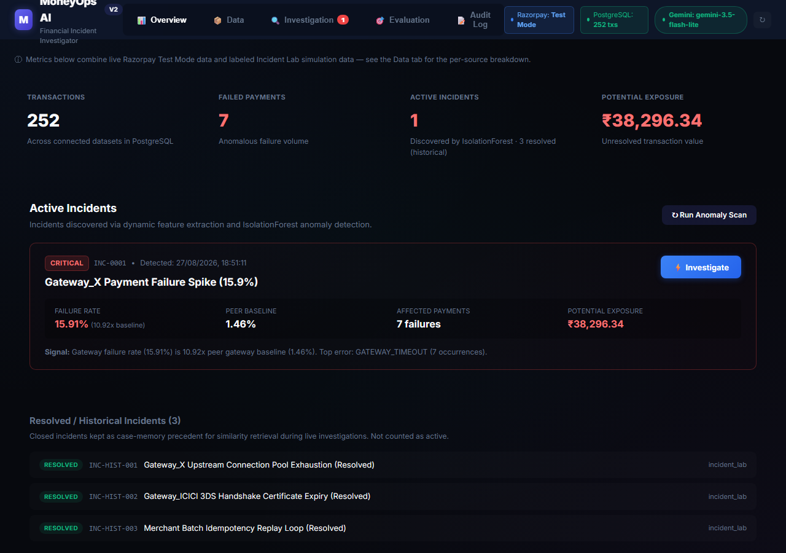
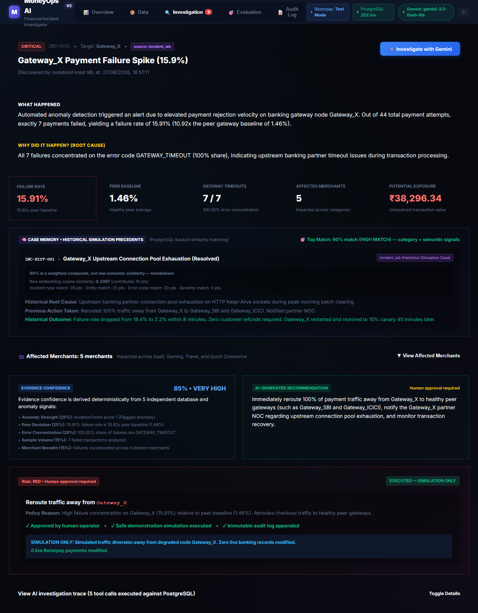
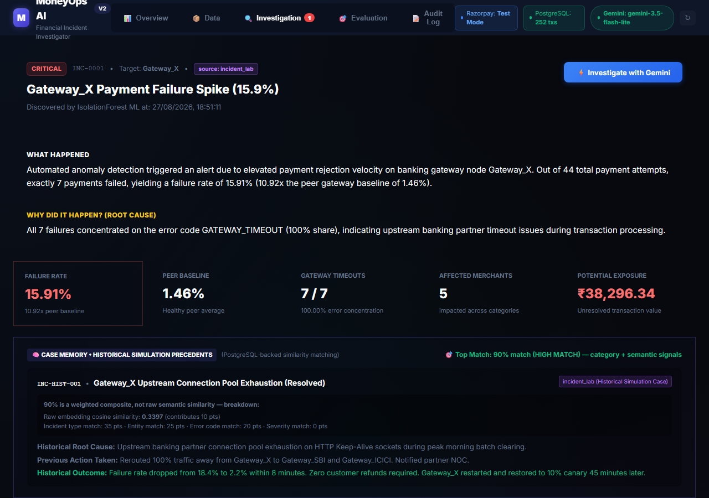
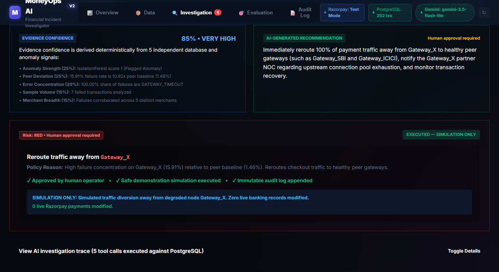
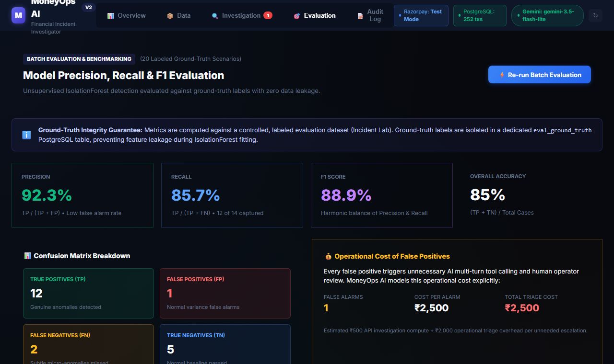

# MoneyOps AI

**An AI that investigates payment failures the way a human financial analyst would — then asks permission before doing anything about it.**

Built for the Razorpay internship selection process.

---

## What this is

When payments on a platform like Razorpay start failing in unusual ways — a banking partner times out, a merchant's refunds spike, a webhook stops delivering — someone has to figure out why, fast, before it costs real money or trust. Normally that means a person digging through dashboards and logs by hand.

This project is an AI system that does that first pass automatically. It watches transaction data, notices when something looks wrong, investigates like a detective — pulling related records, checking if it's seen something similar before — and explains what it found in plain language. It can recommend a fix. But it never acts on its own: a human has to approve anything before it happens, and every step is logged so it can be checked later.

## Why it matters

Payment failures that go unnoticed for hours mean lost revenue and merchants who quietly lose trust in the platform. Manual investigation is slow and repetitive — exactly the kind of task where an AI assistant helps, if it's built carefully. The risk is the "if": letting an AI take actions on financial infrastructure without oversight is a real hazard, not a hypothetical one. This project's actual contribution is less "AI finds problems" (the easy part) and more the discipline around it — how much evidence backs a claim, what an AI is allowed to do unsupervised (nothing), and how visible the difference between real and simulated data stays throughout. That discipline is demonstrated concretely below, not just claimed.

## How it works

1. Transactions flow into the system — real Razorpay test-mode data and a labeled simulation dataset, both clearly tagged so they're never confused with each other (more on this below).
2. The system continuously watches for unusual patterns — a gateway failing far more than its peers, a merchant's refunds spiking, and so on.
3. When something crosses the threshold, it gets flagged as an incident.
4. An AI agent investigates it — pulling the incident's details, checking related transactions, and looking at which merchants were affected, the same way a person would open several tabs to piece together what happened.
5. It checks whether this looks like a past problem the system has seen resolved before, and if so, what worked last time.
6. It writes up what happened, why, and suggests an action — in plain language, with the evidence attached.
7. If the suggested action is risky (like rerouting live payment traffic), it is **never** executed automatically. A human has to explicitly approve it first.
8. Every step — the investigation, the suggestion, the approval, the execution — is written to a permanent log that can't be edited after the fact, so the whole decision trail can be reviewed later.

## See it in action

<table>
<tr><td width="50%">

**The dashboard.** One incident currently needs attention; three past ones are kept for reference, not counted as active.

</td><td width="50%">

**An investigation in progress.** The AI's explanation, backed by real numbers pulled from the database — not a canned description.

</td></tr>
<tr><td width="50%">

**"Have we seen this before?"** A 90% match to a past incident — and the score is broken into exactly what it's made of, not left as an unexplained number.

</td><td width="50%">

**A human approves before anything happens.** The proposed fix, approved, executed as a safe simulation — zero live records touched.

</td></tr>
</table>

**How accurate is the detection, really?** Measured against 20 hand-labeled scenarios the detector never saw during training — including two it missed, shown honestly.

---

## What's real, what's simulated, and why

This is the part that matters most for judging whether any of the above can be trusted, so it isn't buried.

**What's real:**
- A live integration with Razorpay's actual test-mode API — this project creates real Orders on a real Razorpay account (922 of them, confirmed live).
- **Important honesty check:** those are Orders, not paid transactions. Razorpay's checkout page — the screen where a customer would actually enter card details — is protected by bot-detection (hCaptcha and behavioral risk scoring) specifically to stop scripts from completing payments automatically. That protection worked as intended here: this project deliberately did not try to script around it, because doing so would mean working around Razorpay's own fraud defenses. So while 922 real orders exist, real *captured* payments on this account currently stand at 0. This is stated plainly in the app itself, not just here.
- The anomaly detector, the AI investigation agent, the approval workflow, and the audit log are all real, working systems — not mocked for demo purposes. Every screenshot above is a live capture of the running app.

**What's simulated, and why:**
- The bulk of the transaction volume used to demonstrate detection at scale — 250 orders, 250 payments, 5 refunds, 250 webhooks — comes from a synthetic "Incident Lab" generator, not real Razorpay traffic. This exists because safely reproducing a realistic, large-scale gateway failure (hundreds of correlated failed payments in a tight time window) isn't something you can responsibly do against a real payment system, even in test mode. Every simulated record is tagged `incident_lab` end-to-end, in the database, the API, and the UI — it is never blended into a number that implies it's real.

**What's measured, and how:**
- Detection accuracy is evaluated against 20 hand-labeled scenarios (a mix of real incidents and normal operations) that are kept in a separate table from the data the detector learns from, so the model can't "cheat" by having seen the answers. Precision, recall, and F1 are computed directly from that comparison — currently 92.3% / 85.7% / 88.9%, with the two missed cases and their reasons shown openly on the Evaluation page, not hidden.

**One more honesty note, since it came up during development:** the "similarity" score between incidents (the "90% match" shown above) is not a pure AI/semantic similarity score. It's mostly rule-based matching — same incident type, same affected system, same error code — with a smaller contribution from an embedding-based similarity calculation. The UI now shows both numbers side by side (a raw similarity value alongside the final blended score) rather than presenting one unexplained percentage.

---

### Technical details (skip this if you just read section above)

For a technical reader who wants the real architecture: transactions flow through a canonical ingestion pipeline into PostgreSQL, an unsupervised **IsolationForest** model (a statistical method for spotting outliers without needing labeled training data) scores incoming transactions for anomalies, a **Gemini** agent investigates flagged incidents using real multi-turn tool-calling against the database (not a single canned prompt), a hybrid case-memory system retrieves similar past incidents using a mix of categorical matching and embedding cosine similarity, and a three-tier Action Governor enforces human approval on any state-changing action before executing a safe, logged simulation.

Full technical depth — data model, evaluation methodology, governance design, architecture diagrams — is in [`docs/`](docs/), particularly [`ARCHITECTURE.md`](docs/ARCHITECTURE.md) and [`EVALUATION.md`](docs/EVALUATION.md). A full audit of every number in this README, with the exact query behind each one, is in [`NUMBERS_AUDIT.md`](NUMBERS_AUDIT.md).

## How to see it live

This is a local full-stack app (FastAPI + PostgreSQL backend, React frontend) — it isn't hosted anywhere public. The intended way to review it is the demo video / screenshots in this submission, since that's guaranteed to reflect a working, already-verified state.

To run it yourself: set up PostgreSQL and the environment variables in `.env.example`, then `pip install -r backend/requirements.txt && uvicorn app.main:app` from `backend/`, and `npm install && npm run dev` from `frontend/`.

## Status

Everything described above is fully working and has been re-verified end to end, including a full regression test suite (46/46 passing). Deliberately out of scope for this build: at real production scale, ingestion would use something like Kafka or Flink instead of the current direct pipeline, and case-memory retrieval would use a dedicated vector database instead of in-process similarity search — both were conscious scope decisions for a focused submission, not oversights.
