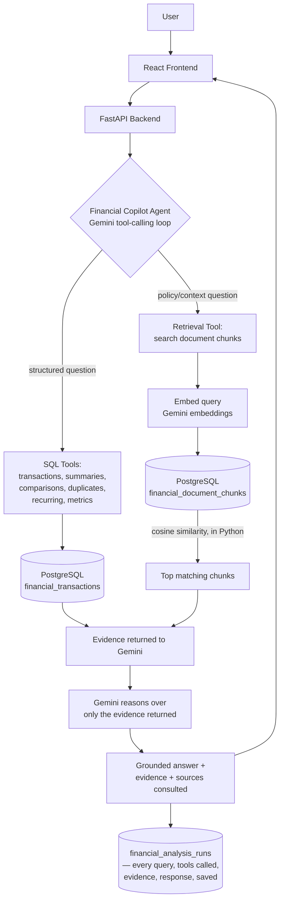

# MoneyOps AI

**Financial Intelligence & Incident Investigation — powered by PostgreSQL, retrieval-augmented reasoning, and Gemini.**

MoneyOps AI is a financial operations platform that answers questions about your money the way a careful financial analyst would: it looks up exact numbers when the question needs exact numbers, it reads the relevant document when the question needs policy or context, and it uses an LLM to reason over that evidence and explain it in plain English — never to invent numbers of its own. The same underlying pattern also powers a payment-operations side of the product: it watches transaction, refund, and webhook data for statistically real anomalies, investigates them with the same evidence-first approach, and requires a human to approve anything before it acts.

It is built for two audiences at once: a business user who uploads a bank statement and asks "why did my spending go up?", and a payments team that needs to know *why* a gateway just started failing and *what to do about it* — without either one ever getting an answer that isn't backed by something real.

---

## 1. The Problem

Financial questions rarely live in one place. Answering them properly usually means pulling from several different sources at once:

- **Transaction records** — exact amounts, dates, merchants (needs precise computation, not a guess)
- **Bank/card statements and fee policies** — the actual documents that explain *why* a charge happened
- **Historical context** — has something like this happened before, and how was it handled?
- **Anomaly signals** — is this pattern actually unusual, or just normal variation?

A generic chatbot can't answer these reliably, for a simple reason: it wasn't built to separate what it *knows* from what it's *making up*. Ask it "what was my largest transaction in July?" and it will happily produce a plausible-sounding number that isn't your real data. In finance, a wrong-but-confident answer is worse than no answer.

MoneyOps AI is built around one rule instead: **use structured data when the question needs exact computation, use retrieved documents when the question needs policy or context, and only let the AI reason over the evidence that was actually retrieved — never let it fill gaps from its own memory.**

---

## 2. What MoneyOps AI Does

### Financial Copilot
The current centerpiece of the product. A user can:
- Upload financial documents (bank statements, CSV/XLSX transaction exports, PDF fee/policy documents)
- Have the system extract structured transactions where the document supports it, and index the rest for retrieval
- Ask natural-language questions ("why did my spending increase this month?", "was this ₹1,999 fee legitimate?")
- Get an answer that combines **real SQL-computed numbers** with **real retrieved document text**, reasoned over by Gemini
- See exactly which transactions and which document sections the answer is based on
- Revisit any previous question later — the full answer is restored instantly, with no new AI call

### Document Intelligence
- Supported formats: **PDF, CSV, XLSX**
- Every upload is parsed, and (for CSV/XLSX, and any PDF that matches a recognizable statement layout) turned into structured transaction rows in PostgreSQL
- The full document text is also split into meaningful chunks and embedded for semantic retrieval
- The original file itself is stored, so it can be previewed or downloaded again later
- A document can be permanently removed — deleting it also removes every chunk and transaction that came from it, so nothing it contained can keep showing up in answers afterward

### Financial Analysis (structured, SQL-backed — not estimated by the AI)
- Spending summaries and category/merchant breakdowns
- Month-over-month (or any two custom date ranges) comparisons, with the delta computed in SQL
- Duplicate-transaction detection (same merchant + amount within a date window)
- Recurring-payment detection (same merchant + amount repeating over time)
- Largest/most-unusual transaction lookups
- A small set of whitelisted deterministic metrics (total spend, average transaction, largest expense, transaction count) — the AI can only ask for one of these by name, never write its own calculation

### Incident Investigation (the original payments-operations side of the product)
- Unsupervised anomaly detection (IsolationForest) over live/simulated payment, refund, and webhook data, with a statistical significance floor so weak signals don't get flagged
- Each detected incident can be investigated by Gemini, which calls a fixed set of read-only database tools to gather evidence before writing up what happened and why
- A case-memory system surfaces similar past incidents and how they were resolved
- Any recommended action goes through a tiered **Action Governor**: higher-risk actions require explicit human approval before a safe, logged simulation is executed — nothing acts on its own
- Every state change is written to an append-only audit log

---

## 3. How It Works



The same "gather evidence with fixed tools, then let Gemini reason over exactly what came back" pattern is reused for the incident-investigation side of the product, against a separate set of payment-operations tools and its own audit trail (see §11).

**Why this matters:** the Gemini call never sees raw database access. It sees a fixed menu of tools, picks the ones relevant to the question, and only gets to write its final answer once those tools have returned real data. If a tool returns nothing, the model is instructed to say the evidence is insufficient rather than fill the gap itself.

---

## 4. RAG Architecture

### Document ingestion
```
Upload → detect file type (PDF / CSV / XLSX)
       → extract text and/or table rows
       → CSV/XLSX: column-heuristic transaction extraction (date, merchant, debit/credit, balance, etc.)
       → PDF: best-effort regex transaction extraction (statement layouts vary; a non-matching
         PDF yields zero transactions rather than invented ones — chunking still works either way)
       → deterministic keyword-based category tagging (e.g. "AWS" → Cloud/Hosting) — a backend
         rule, never something the model decides
       → section-aware chunking (per-page/per-paragraph for PDFs, per ~20-row window for
         spreadsheets — not one fixed-size chunk over the whole file)
       → each chunk embedded and stored
       → original file bytes stored for later preview/download
       → document marked READY (or FAILED with a real reason, never silently)
```

### Retrieval — how search actually works here
This project does **not** use pgvector. It was evaluated and isn't installed on the target PostgreSQL instance, so retrieval instead uses:
- **Real embeddings** from Gemini's embedding model (`gemini-embedding-001`, 3072-dimension vectors)
- Vectors stored as JSON in a regular PostgreSQL column (`financial_document_chunks.embedding_json`)
- Similarity ranking (cosine similarity) computed **in Python** at query time, over the candidate chunks

This is a genuine embedding-based semantic search — not keyword matching — just without a dedicated vector index. At the current data volumes this is fast and simple; a larger deployment would be the natural point to introduce pgvector or a dedicated vector store.

### Grounding
The retrieval and SQL tools' outputs are the *only* source of truth handed to Gemini for a given question. The system prompt explicitly forbids inventing transactions, documents, policy clauses, or financial claims, and requires the model to flag `insufficient_evidence: true` when the tools didn't return enough to answer confidently.

### Source provenance
Every answer carries:
- **Evidence** — each claim tagged as `transaction`, `document`, or `calculation`, with the specific transaction ID or document filename/page/section behind it
- **Sources consulted** — the actual documents (with page/section where applicable) that were retrieved for this question

Nothing is listed as "consulted" unless a retrieval call actually returned it.

---

## 5. Structured Data + RAG: Why Both?

Neither approach alone is enough for financial questions:

| Question | Needs |
|---|---|
| "What was my largest transaction in July?" | **Structured SQL** — an exact `ORDER BY amount` lookup, not a guess |
| "What fee applies to a late payment, per company policy?" | **Document retrieval** — the actual policy text, cited by section |
| "Was this ₹1,999 charge legitimate?" | **Both** — the real transaction *and* the real policy clause, reasoned over together |

MoneyOps AI's Financial Copilot agent decides per-question which tools to call — SQL tools, retrieval tools, or both — and Gemini's job is to synthesize whatever came back, not to answer from either source alone.

---

## 6. Gemini's Role

Gemini is the **reasoning layer over evidence that was already retrieved** — not a source of financial facts by itself.

| | |
|---|---|
| Reasoning model | `gemini-3.5-flash-lite` (configurable via `GEMINI_MODEL`), called via the raw Gemini REST API with function-calling |
| Embedding model | `gemini-embedding-001` |
| Calling pattern | Multi-turn tool-calling loop: Gemini requests a tool → backend executes it in Python/SQL → result is fed back → repeat until Gemini returns a final structured JSON answer |

**Financial Copilot tools Gemini can call** (all backend-executed, parameterized — Gemini never writes or sees SQL):
`search_financial_documents`, `search_financial_policy`, `get_transactions`, `get_transaction_details`, `get_spending_summary`, `compare_periods`, `find_duplicate_transactions`, `find_recurring_transactions`, `calculate_financial_metric` (whitelisted metric names only — any other name is rejected before it can reach a query).

**Incident-investigation tools** (separate registry, same pattern): `get_incident`, `get_gateway_metrics`, `get_failed_payments`, `get_affected_merchants`, `get_merchant_metrics`, `get_merchant_refunds`, `get_webhook_activity`, `find_similar_incidents`, and related read-only lookups.

**Gemini is explicitly instructed, and structurally prevented from:**
- Fabricating transactions, documents, or policy clauses
- Claiming a charge is fraudulent/illegitimate without a tool-returned basis
- Computing totals or comparisons itself (those tools return the number; Gemini reports it)
- Executing any SQL directly, or any write/mutating operation of any kind
- Taking a payment/refund/settlement action without going through the human-approval Action Governor (incident side)

---

## 7. Database Architecture

PostgreSQL is the single source of truth for both sides of the product. No ORM — direct parameterized SQL via `psycopg2`.

**Financial Copilot tables**

| Table | Purpose |
|---|---|
| `financial_accounts` | Logical accounts, derived from an optional account name at upload time |
| `financial_documents` | One row per uploaded file — filename, type, processing status, original file bytes, error message if failed |
| `financial_document_chunks` | Chunked text + embedding vector (JSON) + page/section metadata, per document |
| `financial_transactions` | Structured transaction rows extracted from a document |
| `financial_analysis_runs` | One row per Copilot question — query, tools called, retrieved evidence, model, final response (the auditability record for this feature) |

**Incident-investigation tables**

| Table | Purpose |
|---|---|
| `merchants` / `orders` / `payments` / `refunds` / `webhook_events` | Canonical payment-lifecycle data (real Razorpay Test Mode + labeled Incident Lab simulation, both source-tagged) |
| `incidents` | Detected anomalies — type, severity, status, evidence, detection metadata |
| `ai_investigations` / `ai_investigation_steps` | Gemini's investigation report and the individual tool calls behind it |
| `incident_embeddings` | Deterministic text-vector embeddings used for case-memory similarity matching |
| `governed_actions` / `audit_logs` | Proposed remediation actions and their append-only approval/execution trail |
| `eval_ground_truth` | Labeled scenarios used to benchmark the anomaly detector (see §12) |

A deleted `financial_documents` row cascades to its chunks and transactions automatically (`ON DELETE CASCADE`), so removing a document can never leave orphaned, still-searchable data behind.

---

## 8. Document Library

**Lifecycle:**
```
Upload → original file persisted (PostgreSQL BYTEA)
       → text/transactions extracted
       → chunks created and embedded
       → status: READY (or FAILED, with the real reason shown)
       → immediately visible in the document list
```

**What the UI shows per document:** filename, type, status badge, number of indexed chunks, number of extracted transactions, upload timestamp.

**Actions available:**
- **View/Preview** — a PDF opens in-browser; a CSV/XLSX shows a real table of its extracted rows
- **Download** — serves the exact original uploaded bytes
- **Remove** — asks for confirmation, then permanently deletes the document *and* every chunk/transaction that came from it (verified: a removed document's content can no longer be found by retrieval, and no orphaned rows remain)

---

## 9. User Experience / UI

Current navigation (React, no router — plain tab-based state):

| Tab | What it does |
|---|---|
| **Overview** | Active/resolved incident counts, exposure totals, per-incident evidence cards |
| **Data** | Raw payments/orders/refunds/webhooks by source, Razorpay sync, Incident Lab simulation generator |
| **Investigation** | Full incident detail — evidence, "Investigate with Gemini," case-memory matches, Action Governor approval flow |
| **Financial Copilot** | Document upload, the conversational financial Q&A described above, document library |
| **Audit Log** | The immutable trail of every proposed/approved/rejected/executed action |

> An earlier **Evaluation** page (benchmarking the anomaly detector against 20 labeled scenarios) still exists in the codebase and API but has been removed from navigation in favor of Financial Copilot. It's mentioned here only for technical completeness — it is not a current user-facing feature.

---

## 10. Chat / Investigation Flow

**Financial Copilot, per question:**
1. User types a question; it appears immediately as a message, and an assistant placeholder shows a rotating status ("Analyzing your financial data…" → "Retrieving relevant evidence…" → "Preparing your answer…")
2. The backend runs the Gemini tool-calling loop against the question
3. Only that placeholder is replaced with the real answer when it arrives — every earlier question and answer in the session stays visible
4. The answer, its evidence, and its sources are shown inline
5. The question and full result are saved to `financial_analysis_runs`
6. Clicking any earlier question in "Recent Investigations" restores the stored answer instantly — it does **not** re-run Gemini

**Incident investigation, per incident:** detected → (optionally) investigated with Gemini → evidence-confidence computed deterministically from the real signals returned → case-memory precedent shown → recommendation proposed → human approves or rejects → approved actions execute as a logged, safe simulation → every transition is audit-logged.

---

## 11. Auditability & Provenance

The design goal: **every AI-generated financial conclusion should be traceable back to the specific data or document evidence that produced it.**

- `financial_analysis_runs` — every Copilot query, exactly which tools were called and with what arguments, the evidence those tools returned, and the final response
- `audit_logs` — an append-only record of every incident action's full lifecycle (proposed → approved/rejected → executed), including actor and reason
- `ai_investigation_steps` — every individual tool call Gemini made during an incident investigation, with input/output and latency
- Evidence shown in the UI is tagged by kind (transaction / document / calculation) and, for documents, by filename/page/section — never left as an unexplained claim

---

## 12. Tech Stack

| Layer | Technology | Purpose |
|---|---|---|
| Frontend | React 19, Vite | Single-page dashboard UI |
| Backend | FastAPI, Python | REST API, orchestration |
| Database | PostgreSQL | Single source of truth for all structured and document data |
| DB access | `psycopg2` (raw SQL, no ORM) | Parameterized queries |
| AI reasoning | Google Gemini (`gemini-3.5-flash-lite`), raw REST + function-calling | Reasoning over retrieved evidence |
| Embeddings | Google Gemini (`gemini-embedding-001`) | Semantic vectors for document retrieval |
| Retrieval | In-process cosine similarity (`numpy`) over PostgreSQL-stored vectors | RAG without a dedicated vector DB |
| Document parsing | `pypdf` (PDF), `pandas` / `openpyxl` (CSV/XLSX) | Text and transaction extraction |
| Anomaly detection | `scikit-learn` (IsolationForest) | Unsupervised payment-anomaly scoring |
| File upload | `python-multipart` | FastAPI multipart form handling |
| Testing | `pytest` | Backend test suite (isolated `_test` database, never the real one) |
| Payments integration | Razorpay Test Mode REST API | Real order/payment/refund ingestion |

---

## 13. Project Structure

```text
RzorPayInternProj/
├── backend/
│   ├── app/
│   │   ├── api/
│   │   │   └── routes.py            # every HTTP endpoint
│   │   ├── engine/
│   │   │   ├── financial_copilot_agent.py   # Copilot's Gemini tool-calling loop
│   │   │   ├── financial_tools.py           # Copilot's SQL/retrieval tool registry
│   │   │   ├── document_ingestion.py        # upload -> extract -> chunk -> embed
│   │   │   ├── embeddings.py                # Gemini embedding calls + cosine similarity
│   │   │   ├── gemini_agent.py              # incident investigation's Gemini loop
│   │   │   ├── investigation_tools.py       # incident investigation's tool registry
│   │   │   ├── anomaly_detector.py          # IsolationForest detection
│   │   │   ├── action_governor.py           # human-approval + audit logging
│   │   │   ├── case_memory.py               # historical incident similarity matching
│   │   │   ├── database.py                  # schema (init_db) + connection guard
│   │   │   └── ...
│   │   ├── core/config.py           # environment-driven settings
│   │   ├── models/schemas.py
│   │   └── main.py                  # FastAPI app entrypoint
│   ├── tests/                       # pytest suite (isolated test database)
│   └── requirements.txt
├── frontend/
│   ├── src/
│   │   ├── components/
│   │   │   ├── OverviewView.jsx
│   │   │   ├── DataView.jsx
│   │   │   ├── InvestigationView.jsx
│   │   │   ├── FinancialCopilotView.jsx
│   │   │   ├── AuditView.jsx
│   │   │   └── Header.jsx
│   │   ├── api.js                   # all backend API calls
│   │   └── App.jsx                  # tab navigation + top-level state
│   └── package.json
├── docs/                            # deeper technical write-ups (architecture, data model, etc.)
├── .env.example
├── run_project.ps1 / run_project.bat
└── README.md
```

---

## Running it locally

1. **Database:** install PostgreSQL, then set `DATABASE_URL` in `.env` (see `.env.example`).
2. **Backend:**
   ```
   cd backend
   pip install -r requirements.txt
   uvicorn app.main:app --host 127.0.0.1 --port 8000 --reload
   ```
   (the schema is created automatically on startup)
3. **Frontend:**
   ```
   cd frontend
   npm install
   npm run dev
   ```
4. **Required environment variables** (see `.env.example` for the full list): `DATABASE_URL`, `GEMINI_API_KEY`, `GEMINI_MODEL`. Razorpay credentials are optional — without them the app runs fully on Incident Lab simulation data and user-uploaded financial documents.
5. **Tests:** `cd backend && pytest` — runs against an isolated `<database>_test` database, never the real one.

On Windows, `run_project.ps1` / `run_project.bat` starts PostgreSQL, the backend, and the frontend in one step.
