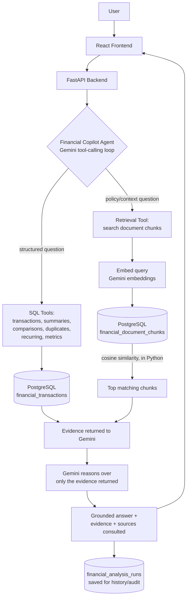

# MoneyOps AI

**A financial investigation system — not a PDF chatbot.**

---

## The Problem

Financial questions rarely live in one place. "Why did my spending increase?" needs exact transaction totals. "Was this fee legitimate?" needs the actual policy document. "Why did this gateway start failing?" needs live operational data. A generic chatbot can't answer any of these reliably, because it can't tell the difference between what it *knows* and what it's *making up* — and a confident, wrong financial answer is worse than no answer at all.

## The Solution

MoneyOps AI decides, per question, what kind of evidence is actually needed — an exact number from PostgreSQL, a passage from an uploaded document, or both — retrieves that evidence with fixed backend tools, and only then asks Gemini to reason over what came back. Gemini never gets to answer from its own general knowledge.

## Why MoneyOps AI?

Most financial AI assistants answer from either:
- structured transaction data, **or**
- uploaded documents.

**MoneyOps AI combines both.** It determines what evidence a question requires, retrieves the relevant financial records *and* documents, and gives Gemini only that evidence to reason over.

That enables questions like:
- "Why did my spending increase this month?"
- "What was my largest transaction?"
- "Does this fee comply with the uploaded policy?"
- "Is this charge unusual?"
- "What happened when this payment gateway started failing?"

The result isn't just an AI-generated answer — it's an **evidence-backed financial investigation**, with the exact transactions and document sections behind every claim, a persistent history of past investigations, and (on the payments-operations side) a human-approval workflow before anything acts on the finding.

---

## How It Works



Gemini never gets raw database access. It sees a fixed menu of tools, picks the ones relevant to the question, and only writes its final answer once those tools have returned real data. The same "retrieve with fixed tools, then reason over exactly what came back" pattern powers the incident-investigation side too, against a separate payment-operations tool set.

---

## What You Can Do

**Financial Copilot** — Upload bank statements, transaction exports, or fee policies; ask natural-language questions; get answers combining real computed numbers with real retrieved document text, with every claim traceable to its source. Past questions are saved and reopen instantly, with no repeat AI call.

**Document Intelligence** — PDF, CSV, and XLSX uploads are parsed into structured transactions (where the format allows) and indexed for semantic search. Original files are stored for preview/download. Deleting a document removes every chunk and transaction derived from it — nothing lingers in retrieval after removal.

**Incident Investigation** — Unsupervised anomaly detection (IsolationForest) over payment/refund/webhook data flags statistically real incidents. Gemini investigates each one using read-only tools, checks historical case memory for precedent, and proposes a remediation action. Higher-risk actions require explicit human approval before a logged, safe simulation executes — nothing acts on its own.

**Auditability** — Every Copilot query (tools called, evidence retrieved, final answer) and every incident action (proposed → approved/rejected → executed) is permanently recorded, so any AI-generated conclusion can be traced back to what actually produced it.

---

## Example

```
"Was this ₹1,999 fee legitimate?"
        ↓
   Financial Copilot Agent
        ↓
 ┌──────────────┬───────────────────┐
 │  SQL lookup   │   Document search  │
 │  (the real    │   (the fee policy, │
 │  transaction) │   embedded chunks) │
 └──────┬────────┴─────────┬─────────┘
        └──────┬────────────┘
               ↓
     Gemini reasons over both
               ↓
"Yes — ₹1,999 late-payment fee on 2026-08-14,
 matching Section 1 of the uploaded fee policy."
        + evidence + sources consulted
```

This is a real, verified output from the running app — not an illustrative mockup.

---

## Current Status

Feature-complete and demo-ready. All five navigated pages (Overview, Data, Investigation,
Financial Copilot, Audit Log) are finished for this phase — this is a portfolio/internship
prototype, not a claimed production financial system, and it runs against Razorpay **Test
Mode** plus a clearly labeled synthetic "Incident Lab" dataset (see "Database tables" further
down for exactly how those are separated).

Known limitations, stated plainly rather than hidden:
- Case-memory "similarity" is a composite score (real cosine similarity plus rule-based
  category/entity/error-code bonuses) over a small seeded set of historical precedents — not a
  large-scale learned similarity model.
- RAG retrieval uses real Gemini embeddings but no vector index (`pgvector` isn't installed on
  the target PostgreSQL) — cosine similarity is computed in Python at query time, which is fine
  at this data scale.
- PDF/CSV/XLSX parsing is best-effort (regex for PDFs, column heuristics for spreadsheets); a
  statement layout that doesn't match yields zero extracted transactions rather than a guess.
- Governed actions execute as a logged, safe simulation — nothing in this codebase ever mutates
  a real Razorpay resource.

---

## Tech Stack

| Layer | Technology | Purpose |
|---|---|---|
| Frontend | React 19, Vite | Single-page dashboard UI |
| Backend | FastAPI, Python | REST API, orchestration |
| Database | PostgreSQL | Single source of truth for all structured and document data |
| DB access | `psycopg2` (raw SQL, no ORM) | Parameterized queries |
| AI reasoning | Google Gemini (`gemini-3.5-flash-lite`), raw REST + function-calling | Reasoning over retrieved evidence |
| Embeddings | Google Gemini (`gemini-embedding-001`) | Semantic vectors for document retrieval |
| Retrieval | In-process cosine similarity (`numpy`) over PostgreSQL-stored vectors | RAG without a dedicated vector DB |
| Document parsing | `pypdf` (PDF), `pandas` / `openpyxl` (CSV/XLSX) | Text and transaction extraction |
| Anomaly detection | `scikit-learn` (IsolationForest) | Unsupervised payment-anomaly scoring |
| File upload | `python-multipart` | FastAPI multipart form handling |
| Testing | `pytest` | Backend test suite (isolated `_test` database, never the real one) |
| Payments integration | Razorpay Test Mode REST API | Real order/payment/refund ingestion |

---

## Running It Locally

1. **Database:** install PostgreSQL, then set `DATABASE_URL` in `.env` (see `.env.example`).
2. **Backend:**
   ```
   cd backend
   pip install -r requirements.txt
   uvicorn app.main:app --host 127.0.0.1 --port 8000 --reload
   ```
   (the schema is created automatically on startup)
3. **Frontend:**
   ```
   cd frontend
   npm install
   npm run dev
   ```
4. **Required environment variables** (see `.env.example`): `DATABASE_URL`, `GEMINI_API_KEY`, `GEMINI_MODEL`. Razorpay credentials are optional — without them the app runs fully on Incident Lab simulation data and user-uploaded financial documents.
5. **Tests:** `cd backend && pytest` — runs against an isolated `<database>_test` database, never the real one.

On Windows, `run_project.ps1` / `run_project.bat` starts PostgreSQL, the backend, and the frontend in one step.

---

## Project Structure

```text
RzorPayInternProj/
├── backend/
│   ├── app/
│   │   ├── api/routes.py                    # every HTTP endpoint
│   │   ├── engine/
│   │   │   ├── financial_copilot_agent.py   # Copilot's Gemini tool-calling loop
│   │   │   ├── financial_tools.py           # Copilot's SQL/retrieval tool registry
│   │   │   ├── document_ingestion.py        # upload -> extract -> chunk -> embed
│   │   │   ├── embeddings.py                # Gemini embedding calls + cosine similarity
│   │   │   ├── gemini_agent.py              # incident investigation's Gemini loop
│   │   │   ├── investigation_tools.py       # incident investigation's tool registry
│   │   │   ├── anomaly_detector.py          # IsolationForest detection
│   │   │   ├── action_governor.py           # human-approval + audit logging
│   │   │   ├── case_memory.py               # historical incident similarity matching
│   │   │   └── database.py                  # schema (init_db) + connection guard
│   │   ├── core/config.py                   # environment-driven settings
│   │   └── main.py                          # FastAPI app entrypoint
│   ├── tests/                                # pytest suite (isolated test database)
│   └── requirements.txt
├── frontend/src/
│   ├── components/ (OverviewView, DataView, InvestigationView,
│   │                FinancialCopilotView, AuditView, Header)
│   ├── api.js                                # all backend API calls
│   └── App.jsx                               # tab navigation + top-level state
├── .env.example
└── run_project.ps1 / run_project.bat
```

---

## Technical Deep Dive

<details>
<summary><strong>RAG architecture — ingestion, retrieval, grounding</strong></summary>

**Ingestion:** upload → detect file type → extract text/table rows → CSV/XLSX use column-heuristic transaction extraction (date, merchant, debit/credit, balance); PDFs use best-effort regex extraction (a non-matching layout yields zero transactions, never invented ones) → deterministic keyword-based category tagging (a backend rule, not a model decision) → section-aware chunking (per-page/paragraph for PDFs, per ~20-row window for spreadsheets) → each chunk embedded and stored → original file bytes stored for preview/download → document marked READY or FAILED with a real reason.

**Retrieval:** this project does **not** use pgvector — it isn't installed on the target PostgreSQL instance. Retrieval instead uses real embeddings from Gemini's embedding model (`gemini-embedding-001`, 3072-dimensions), stored as JSON in a regular PostgreSQL column, ranked by cosine similarity computed in Python at query time. This is genuine embedding-based semantic search, just without a dedicated vector index — a larger deployment would be the natural point to introduce one.

**Grounding:** the retrieval and SQL tools' outputs are the only evidence handed to Gemini for a question. The architecture minimizes hallucination by requiring every financial claim in the final answer to be traced to a specific tool result, and by instructing the model to flag `insufficient_evidence: true` when the tools didn't return enough to answer confidently — this is a prompting and evidence-gathering discipline, not a guarantee that hallucination is impossible.

**Provenance:** every answer carries evidence entries tagged `transaction`, `document`, or `calculation` (with the transaction ID or document filename/page/section behind each one), plus a "sources consulted" list — nothing is listed unless a retrieval call actually returned it.

</details>

<details>
<summary><strong>Gemini's role and tool boundaries</strong></summary>

Gemini is the reasoning layer over evidence that was already retrieved, not a source of financial facts by itself.

| | |
|---|---|
| Reasoning model | `gemini-3.5-flash-lite` (configurable via `GEMINI_MODEL`), raw REST API with function-calling |
| Embedding model | `gemini-embedding-001` |
| Calling pattern | Multi-turn loop: Gemini requests a tool → backend executes it in Python/SQL → result fed back → repeat until a final structured JSON answer |

**Financial Copilot tools** (all backend-executed and parameterized — Gemini never writes or sees SQL): `search_financial_documents`, `search_financial_policy`, `get_transactions`, `get_transaction_details`, `get_spending_summary`, `compare_periods`, `find_duplicate_transactions`, `find_recurring_transactions`, `calculate_financial_metric` (a whitelisted set of metric names — anything else is rejected before it reaches a query).

**Incident-investigation tools** (separate registry, same pattern): `get_incident`, `get_gateway_metrics`, `get_failed_payments`, `get_affected_merchants`, `get_merchant_metrics`, `get_merchant_refunds`, `get_webhook_activity`, `find_similar_incidents`, and related read-only lookups.

The system prompt and tool design are intended to keep Gemini from: fabricating transactions/documents/policy clauses, claiming a charge is fraudulent without a tool-returned basis, computing totals itself (tools return the number; Gemini reports it), running any SQL or write operation directly, or taking a payment/settlement action without going through the human-approval Action Governor.

</details>

<details>
<summary><strong>Database tables</strong></summary>

**Financial Copilot**

| Table | Purpose |
|---|---|
| `financial_accounts` | Logical accounts, derived from an optional account name at upload |
| `financial_documents` | One row per upload — filename, type, status, original file bytes, error message if failed |
| `financial_document_chunks` | Chunked text + embedding vector (JSON) + page/section metadata |
| `financial_transactions` | Structured transaction rows extracted from a document |
| `financial_analysis_runs` | One row per Copilot question — query, tools called, evidence, response |

**Incident investigation**

| Table | Purpose |
|---|---|
| `merchants` / `orders` / `payments` / `refunds` / `webhook_events` | Canonical payment-lifecycle data (real + labeled simulation, source-tagged) |
| `incidents` | Detected anomalies — type, severity, status, evidence |
| `ai_investigations` / `ai_investigation_steps` | Gemini's report and the individual tool calls behind it |
| `incident_embeddings` | Deterministic text-vector embeddings for case-memory matching |
| `governed_actions` / `audit_logs` | Proposed actions and their append-only approval/execution trail |
| `eval_ground_truth` | Labeled scenarios used to benchmark the anomaly detector |

A deleted `financial_documents` row cascades to its chunks and transactions (`ON DELETE CASCADE`) — removing a document can't leave orphaned, still-searchable data behind.

</details>

<details>
<summary><strong>UI navigation and per-question flow</strong></summary>

| Tab | What it does |
|---|---|
| Overview | Active/resolved incident counts, exposure totals, per-incident evidence cards |
| Data | Raw payments/orders/refunds/webhooks by source, Razorpay sync, Incident Lab generator |
| Investigation | Full incident detail, "Investigate with Gemini," case memory, Action Governor approval |
| Financial Copilot | Document upload, conversational financial Q&A, document library |
| Audit Log | The immutable trail of every proposed/approved/rejected/executed action |

An earlier **Evaluation** page (benchmarking the anomaly detector against 20 labeled scenarios) still exists in the codebase/API but was removed from navigation in favor of Financial Copilot — mentioned here for completeness only, not a current user-facing feature.

**Financial Copilot per question:** the question appears immediately as a message, with an assistant placeholder cycling through status text while the tool-calling loop runs; only that placeholder is replaced when the real answer arrives, and every earlier Q&A in the session stays visible. The question and full result are saved to `financial_analysis_runs`; clicking any earlier question in "Recent Investigations" restores the stored answer instantly, without re-running Gemini.

**Incident investigation:** detected → (optionally) investigated by Gemini → evidence-confidence computed from the real signals returned → case-memory precedent shown → recommendation proposed → human approves or rejects → approved actions execute as a logged, safe simulation → every transition is audit-logged.

</details>
