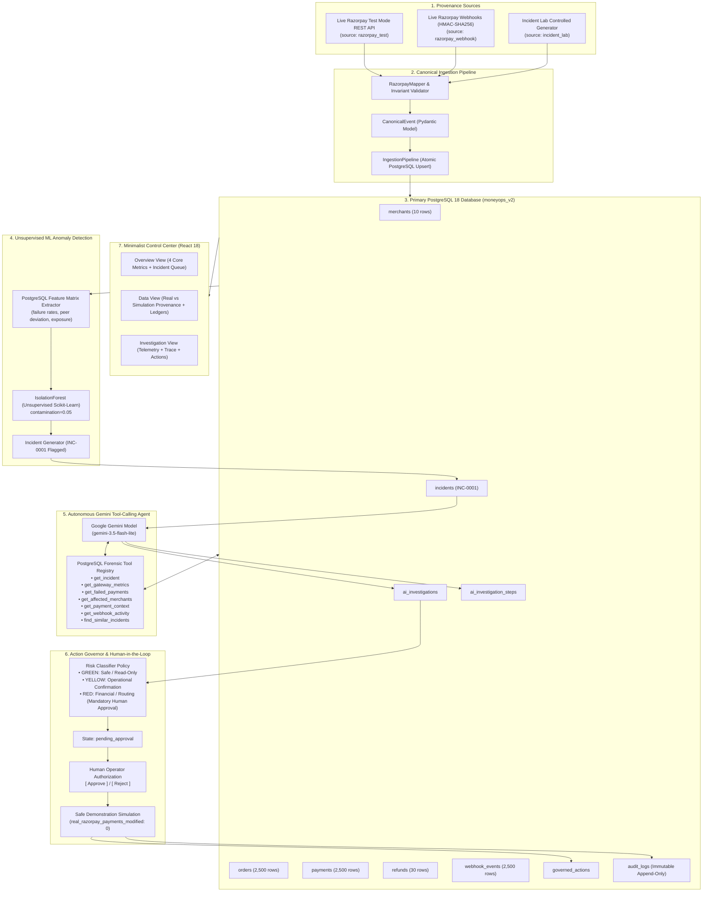

# MONEYOPS AI V2 — ARCHITECTURE & DATA FLOW SPECIFICATION

> **System Overview:** Autonomous Financial Incident Investigator for High-Throughput Payment Gateways  
> **Core Principle:** `SOURCE → INGEST → STORE → DETECT → INVESTIGATE → RECOMMEND → APPROVE → EXECUTE (SIMULATED) → AUDIT`

---

## 1. End-to-End System Flow Architecture

---

## 2. 7-Stage Pipeline Breakdown

### Stage 1: Data Ingestion & Source Provenance
- **Razorpay REST Adapter:** Queries official Razorpay endpoints (`/v1/orders`, `/v1/payments`, `/v1/refunds`), maps JSON payloads into unified `CanonicalEvent` models, and tags provenance as `source: 'razorpay_test'`.
- **Razorpay Webhooks:** Verifies HMAC-SHA256 signatures with constant-time equality check, enforces event idempotency via `event_id` uniqueness, and tags provenance as `source: 'razorpay_webhook'`.
- **Incident Lab:** Generates high-volume multi-merchant synthetic lifecycles (2,500 transactions across 10 merchants) with seed reproducibility (`seed=42`) and tags provenance as `source: 'incident_lab'`.

### Stage 2: Unified Ingestion Engine
- Converts all entities to immutable `CanonicalEvent` representations.
- Enforces decimal financial precision (never float math).
- Executes idempotent upserts against PostgreSQL 18 with relational integrity (`merchants` $\to$ `orders` $\to$ `payments` $\to$ `refunds`).

### Stage 3: Unsupervised Feature Extraction & Isolation Forest
- **No hardcoding:** The detector possesses zero prior knowledge of `Gateway_X` or injected anomaly types.
- Feature vectors calculate:
  $$\text{Failure Rate} = \frac{\text{Failed Payments}}{\text{Total Attempts}}$$
  $$\text{Peer Deviation} = \frac{\text{Gateway Failure Rate}}{\text{Peer Gateway Baseline}}$$
- `IsolationForest` scans 5-dimensional feature matrices and discovers anomalies with negative anomaly scores.
- Persists structured incident records in `incidents` with severity, financial exposure, and baseline metrics.

### Stage 4: Generative AI Investigation Engine (Google Gemini)
- Triggers multi-turn autonomous tool-calling loop.
- The LLM receives the incident ID and inspects PostgreSQL via parameterized SQL forensic tools:
  1. `get_incident(incident_id)`: Fetches detected anomaly parameters.
  2. `get_gateway_metrics(gateway)`: Computes statistical failure rates, baseline comparisons, and error distributions.
  3. `get_failed_payments(gateway, limit)`: Samples actual transaction failure codes (`GATEWAY_TIMEOUT`).
  4. `get_affected_merchants(gateway)`: Aggregates merchant-specific volume and financial exposure.
- Stores every tool turn (tool name, arguments, database result, latency) into `ai_investigation_steps`.
- Persists final evidence-backed findings into `ai_investigations`.

### Stage 5: Action Governor & Human-in-the-Loop
- Evaluates risk classification for proposed recommendations:
  - `reroute_gateway_traffic` $\to$ **`RED`** (Human approval mandatory).
- Enforces state machine invariants:
  - `pending_approval` $\to$ `approved` (by human operator) $\to$ `executed (SIMULATION)`.
  - Blocks any attempt to execute unapproved actions (HTTP 400).
  - Enforces safe simulation invariant: `real_razorpay_payments_modified: 0`.

### Stage 6: Immutable Append-Only Audit Trail
- Every state transition appends an immutable record into PostgreSQL `audit_logs`:
  - `audit_id`
  - `action_id`
  - `incident_id`
  - `previous_status` $\to$ `new_status`
  - `actor` (e.g. `Gemini_Agent`, `Human_Operator`)
  - `reason` & `execution_result`
  - `timestamp`

### Stage 7: Minimalist FinOps Control Center
- High-signal 3-view UX:
  - **Overview:** 4 Key Metrics (Transactions, Failed Payments, Active Incidents, Exposure) + Active Incident Queue.
  - **Data:** Explicit Real vs Simulation Provenance Breakdown + Tabbed Entity Ledgers.
  - **Investigation:** Structured telemetry (What Happened $\to$ Why $\to$ 4 Evidence Cards $\to$ AI Recommendation $\to$ Action Governor $\to$ Collapsible AI Tool Trace).
